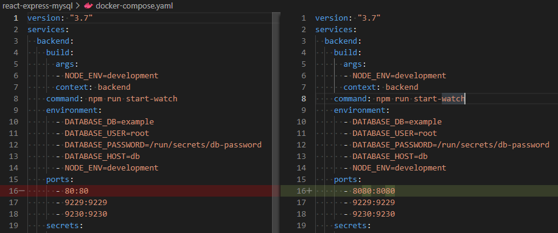
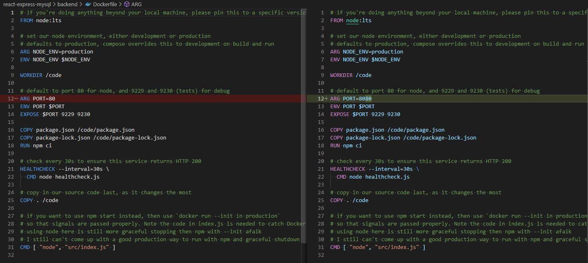
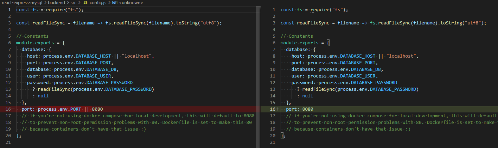
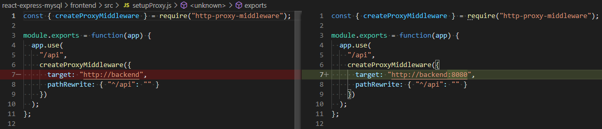
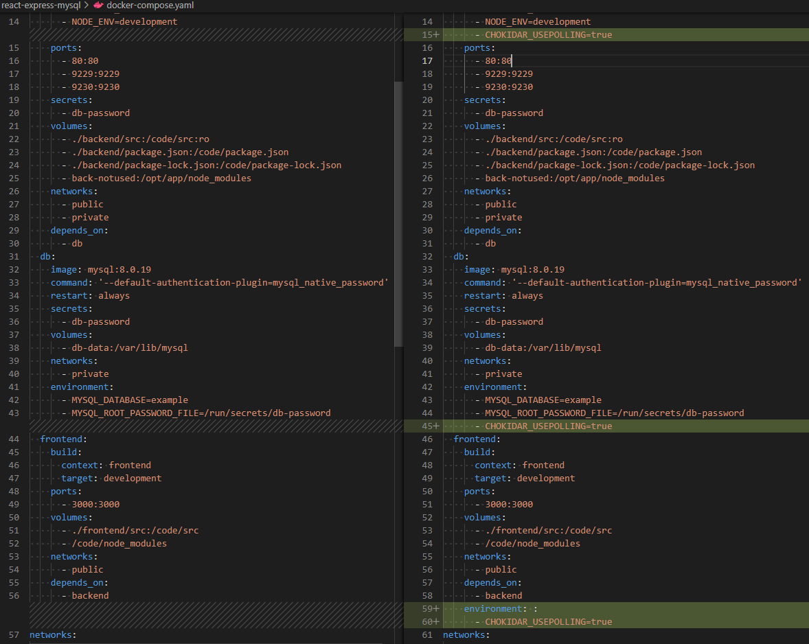

## Compose sample application
### React application with a NodeJS backend and a MySQL database

The compose file defines an application with three services `frontend`, `backend` and `db`.
When deploying the application, docker-compose maps port 3000 of the frontend service container to port 3000 of the host as specified in the file.
Make sure port 3000, and port 80 on the host are not already in use.

After the application starts, navigate to `http://localhost:3000` in your web browser.

The backend service container has the port 80 mapped to 80 on the host.

## Steps to Run Locally

1. Install [Docker Desktop App](https://www.docker.com/products/docker-desktop).
2. Install [Git](https://git-scm.com/downloads).
3. Clone [docker-compose-labs](https://github.com/n3rd253/docker-compose-labs.git) Repo using Git in your terminal.
4. Run `docker-compose build` from the react-express-mysql folder.
5. Run `docker-compose up`
6. Access http://localhost:3000

## Modifying backend port configuration

It is possible that you may have port 80 tied up elsewhere, if so, please follow the shots below to change the port that the front end is proxying to.
1. Change port number in docker-compost.yaml

2. Change PORT in backend/Dockerfile

3. Change port in backend/src/config.js

4. Change target in frontend/src/setupProxy.js

## Not seeing your changes?
If you don't see backend changes applied when you refresh, or frontend changes, place the CHOKIDAR_USEPOLLING=true environment variable in your docker-compose file.

### Setup references

References for setting up a Node project with Docker and docker-compose:

- https://nodejs.org/en/docs/guides/nodejs-docker-webapp/
- https://blog.codeship.com/using-docker-compose-for-nodejs-development/
- http://jdlm.info/articles/2016/03/06/lessons-building-node-app-docker.html

Express + React:

- https://daveceddia.com/create-react-app-express-production/
- http://ericsowell.com/blog/2017/5/16/create-react-app-and-express
- https://medium.freecodecamp.org/how-to-make-create-react-app-work-with-a-node-backend-api-7c5c48acb1b0
- https://medium.freecodecamp.org/how-to-host-a-website-on-s3-without-getting-lost-in-the-sea-e2b82aa6cd38